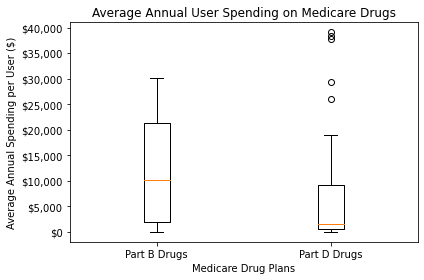

# Medicare Drug Cost Analysis

Python analysis project by [Shawn Varghese](https://github.com/Shawn-Varghese), [Charles Phil](https://github.com/charlesphil), [Racine Ellis](https://github.com/Sweet10Ray17), [Jerome Amose](https://github.com/Jerome4059), and [Travis Lucas](https://github.com/FastlifeFuture).

## Overview

Medicare plays a key role in providing healthcare and financial security to 60 million older people and younger people with disabilities. For this project, we conducted an analysis of how much Medicare beneficiaries spent on prescription drugs between Medicare Part B and Part D from 2010 to 2015 and examined beneficiaries who received low-income subsidies against those who did not.

## Definitions

**Part B:** This is the Medicare outpatient benefit plan available through the government. This plan covers drugs that are normally administered at a doctor's office or other outpatient settings such as vaccines, blood clotting factors, or immunosuppressive drugs.

**Part D:** This plan is only offered through private insurance companies that have contracts with the federal government. This plan covers a wide range of prescription drugs, both brand name and generic. This part has the largest drug coverage.

## Data Cleaning

A curated list of Medicare prescription drugs was uploaded on [data.world](https://data.world/carlvlewis/medicare-rx-spending-10-15) by user [@carlvlewis](https://data.world/carlvlewis). To clean the dataset, we removed all drugs that did not have values for all six years.

## Data Exploration

### Do Part B or Part D Beneficiaries spend more out of pocket?

According to the data, Part B beneficiaries spent more money out of pocket for prescription drugs than Part D beneficiaries. Part B beneficiaries spent $13.7 billion while Part D beneficiaries spent $12.3 billion.

### Between Part D beneficiaries, do costs differ between Low Income Subsidy (LIS) recipients and those without LIS?

LIS-receiving beneficiaries spend significantly less on drugs than high-income beneficiaries. This may be because beneficiaries with low incomes are mostly comprised of older adults and younger adults with disabilities who aren't able to afford expensive drugs out of pocket.

We also see that high-income beneficiaries also spend more over time than low-income beneficiaries.

### Between Part B and Part D, how have the average cost per unit of drug varied between 2010 and 2015?

Each point in this line graph represents the mean of the average cost per unit for every drug in each year. They have similar trends as they both are on an increasing path. However, Part D drugs are *significantly more volatile*. We can conclude that the cost of private drugs are on an increase while the outpatient drugs in Part B have remained consistent in price.

### Compare the average total annual spending per beneficiary across the six years

 

With the extreme outliers removed, we see that the majority of Part D Drugs have a relatively low amount of annual spending compared to Part B drugs. However, Part D drugs also seem to have an enormous range, especially given the extremely high spending costs of a few prescription drugs which skews the data. The majority of Part B drugs span a larger range, but are other all entirely contained within that range. This probably has to do with the fact that the Part B class of drugs are usually used in ambulatory or outpatient care settings, meaning that the cost *floor* is on average higher than the drugs in Part D.

